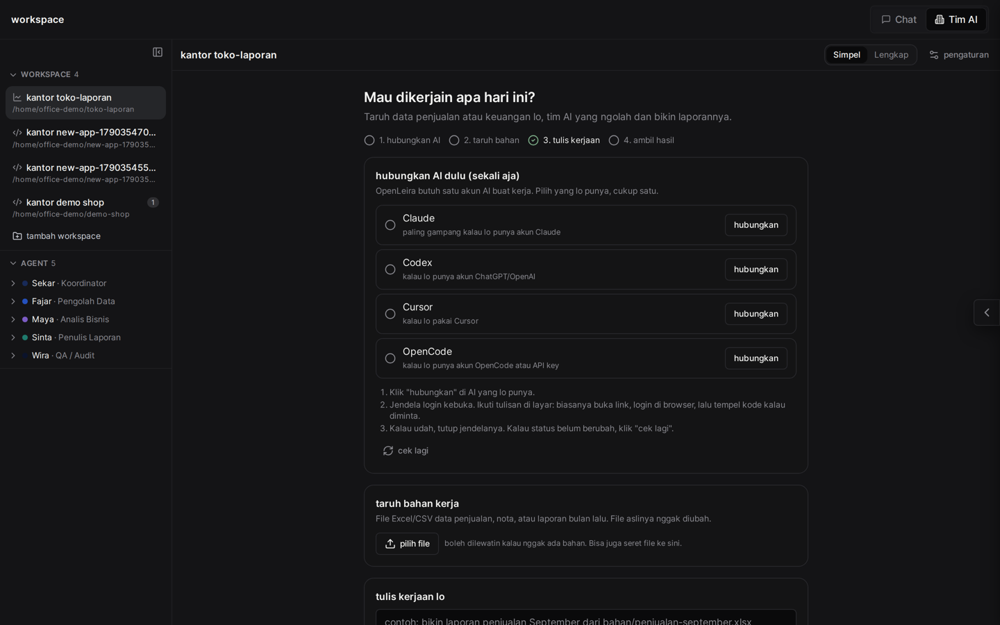
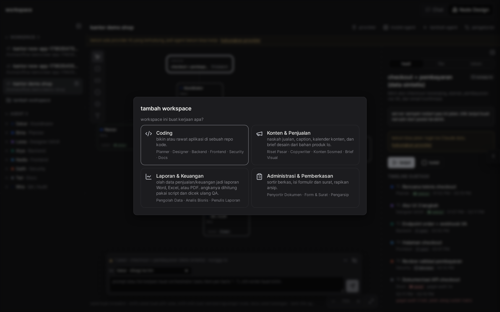
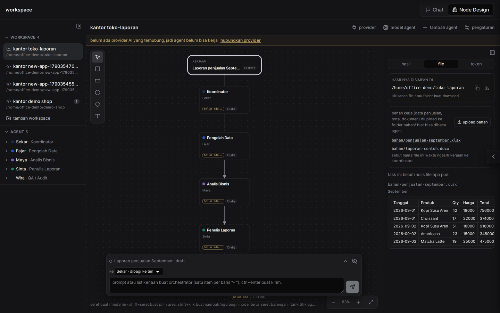

<div align="center">
 
 <h1>OpenLeira</h1>
 <p><b>Tim AI lo sendiri.</b> Tulis kerjaannya, koordinator bagi tugas ke tim agent AI, tiap anggota kerja barengan tanpa tabrakan, lalu QA ngecek hasilnya sebelum dianggap beres. Jalan di server atau komputer lo sendiri.</p>
</div>

<p align="center">
 <a href="https://openleira.online">openleira.online</a> · <a href="docs/install-windows.md">Pasang di Windows</a> · <a href="docs/workspace-ai.md">Dokumentasi</a> · <a href="https://github.com/arieldevs23/openleira/issues">Laporkan masalah</a> · <a href="CONTRIBUTING.md">Kontribusi</a>
</p>

<p align="center"><i>English: OpenLeira is a self-hosted workspace where a team of AI agents (Claude Code, Codex, Cursor, OpenCode) works for you. You write the job, a coordinator splits it across teams, they work in parallel, and a QA layer checks every result. It works for code, content, reports, documents and more.</i></p>

---

## Tampilannya

<div align="center">
<table>
<tr>
<td align="center"><b>Tampilan Simpel</b><br><br><em>hubungkan AI → taruh bahan → tulis kerjaan → ambil hasil</em></td>
<td align="center"><b>Pilih jenis kerjaan</b><br><br><em>13 jenis, termasuk Kustom</em></td>
</tr>
<tr>
<td align="center"><b>Tampilan Lengkap</b><br><br><em>kanvas tim, alur kerja, dan status tiap agent</em></td>
<td align="center"><b>Hasil langsung dilihat</b><br><br><em>preview Excel, Word, PDF, dan gambar</em></td>
</tr>
</table>
</div>

## Cara kerjanya

1. **Hubungkan AI, sekali aja.** Pakai akun yang lo punya: Claude, ChatGPT/Codex, Cursor, atau OpenCode. Model buat tiap anggota tim dipilihin otomatis.
2. **Taruh bahan.** File Excel, nota, dokumen, katalog, apa pun yang dibutuhin tim.
3. **Tulis kerjaan** pakai bahasa biasa. Beberapa baris `- ` jadi beberapa kerjaan yang dikerjain gantian.
4. **Ambil hasil.** Lihat status tiap anggota tim, ringkasan dari koordinator, dan file hasilnya (bisa di-preview atau di-download). Kalau koordinator nanya, jawab di tempat.

Di balik layar: koordinator nyusun rencana → tiap tim ngerjain bagiannya (satu tim cuma pegang satu tugas sekaligus, dan dikasih tahu kerjaan lain yang lagi jalan) → QA ngecek tiap hasil dan minta revisi kalau ada yang kurang → koordinator nulis ringkasan akhir.

## Jenis workspace

| Jenis | Tim awal |
|---|---|
| Coding | Planner, Designer UI/UX, Backend, Frontend, Security, Docs |
| Konten & Penjualan | Riset Pasar, Copywriter, Konten Sosmed, Brief Visual |
| Laporan & Keuangan | Pengolah Data, Analis Bisnis, Penulis Laporan |
| Administrasi & Pemberkasan | Penyortir Dokumen, Form & Surat, Pengarsip |
| Riset & Analisis | Pencari Sumber, Analis, Penulis Ringkasan |
| Materi & Pelatihan | Perancang Materi, Penulis Materi, Pembuat Soal |
| Layanan Pelanggan | Analis Keluhan, Penulis Balasan, Penyusun FAQ & SOP |
| HR & Rekrutmen | Penyusun Lowongan, Penyaring CV, Penyusun Onboarding |
| Draf Dokumen Legal | Peninjau Dokumen, Penyusun Draf, Pengecek Konsistensi |
| Toko Online | Pengelola Katalog, Penulis Listing, Perencana Promo |
| Terjemahan | Pengelola Istilah, Penerjemah, Penyunting |
| Proyek & Acara | Perencana, Penyusun Anggaran, Penulis Komunikasi |
| **Kustom** | tim yang lo susun sendiri, plus cara QA ngecek yang lo tulis sendiri |

Tiap jenis punya alur kerja, aturan, dan cara QA ngecek sendiri. Contohnya, di Laporan & Keuangan angka wajib dihitung pakai script dan QA ngitung ulang dari data sumber. Detailnya ada di [dokumentasi](docs/workspace-ai.md).

## Fitur lain

- **Tampilan Lengkap**: kanvas ala draw.io buat ngatur tim, gambar alur kerja (panah = urutan), kasih skill ke agent, dan pantau pemakaian token.
- **Chat dan terminal biasa** buat ngobrol langsung dengan Claude Code, Codex, Cursor, atau OpenCode di proyek lo.
- **File explorer, editor kode, dan Git/GitHub** (clone, push, pull).
- **Bisa dibuka dari HP**, tampilannya responsif.

## Pasang

### Windows

Download **`OpenLeira-Setup-<versi>.exe`** dari halaman [Releases](https://github.com/arieldevs23/openleira/releases), lalu ikuti [panduan pasang di Windows](docs/install-windows.md). Server-nya ikut di installer, jadi langsung jalan.

### Dari source code (Linux, macOS, Windows, server/VPS)

Butuh **Node.js 22+** dan Git.

```bash
git clone https://github.com/arieldevs23/openleira.git
cd openleira
npm ci
npm run build
npm run server
```

Buka `http://localhost:3001`, bikin akun login lokal, lalu pilih **Tim AI** di kanan atas. Port dan pengaturan lain bisa diubah lewat file `.env` (contohnya di `.env.example`).

Buat development: `npm run dev` (server + Vite dengan hot reload).

## Privasi dan keamanan

- Aplikasi, database, dan file kerja lo ada di server atau komputer lo sendiri.
- **Tapi isi file yang dibaca agent tetap dikirim ke penyedia AI** (Anthropic, OpenAI, dll.) waktu agent kerja. Jangan taruh data yang nggak boleh keluar.
- Secara bawaan agent jalan tanpa minta izin satu-satu di folder workspace-nya. Mode yang lebih ketat bisa dipilih di pengaturan workspace.
- Hasil hitungan, dokumen legal, dan keputusan HR tetap perlu dicek manusia. Agent bukan pengganti akuntan, pengacara, atau rekruter.

## Dokumentasi

- [Workspace AI (tim agent)](docs/workspace-ai.md)
- [Pasang di Windows](docs/install-windows.md)
- [Desain dan tema](docs/DESIGN.md)
- [Kontribusi](CONTRIBUTING.md)

## Asal-usul dan lisensi

OpenLeira dikembangkan dari **[CloudCLI UI](https://github.com/siteboon/claudecodeui)** (aka Claude Code UI) karya Siteboon AI B.V. dan para kontributornya. Terima kasih buat mereka: chat, terminal, file explorer, Git, plugin, dan aplikasi desktopnya berasal dari sana. OpenLeira menambahkan workspace tim AI, jenis-jenis workspace, tampilan Simpel, dan tema gothic-nya.

Lisensinya tetap **GNU Affero General Public License v3.0 or later (AGPL-3.0-or-later)**: lihat [LICENSE](LICENSE) dan [NOTICE](NOTICE). Kalau lo ngubah software ini dan menjalankannya sebagai layanan jaringan, source code hasil ubahan lo wajib dibuka buat penggunanya.

README terjemahan lama di folder `docs/README.*.md` masih menjelaskan CloudCLI dan belum diperbarui.

### Dibangun dengan

[Claude Code](https://docs.anthropic.com/en/docs/claude-code) · [Codex](https://developers.openai.com/codex) · [Cursor CLI](https://docs.cursor.com/en/cli/overview) · [OpenCode](https://opencode.ai) · [React](https://react.dev/) · [Vite](https://vitejs.dev/) · [Tailwind CSS](https://tailwindcss.com/) · [CodeMirror](https://codemirror.net/) · [Electron](https://www.electronjs.org/)
