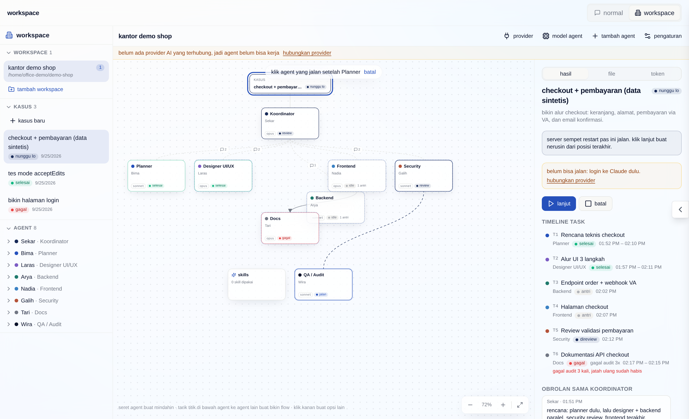
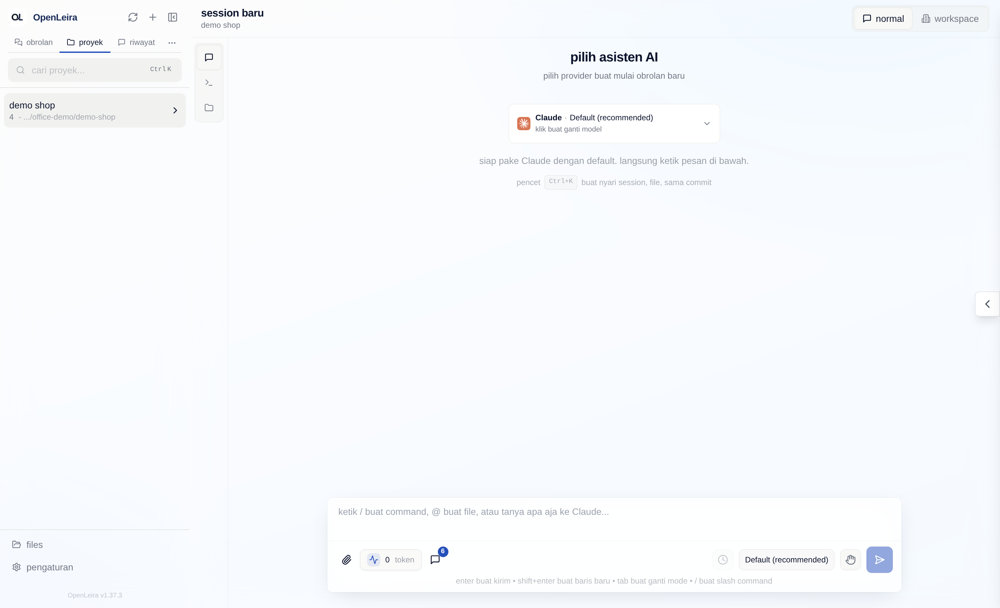
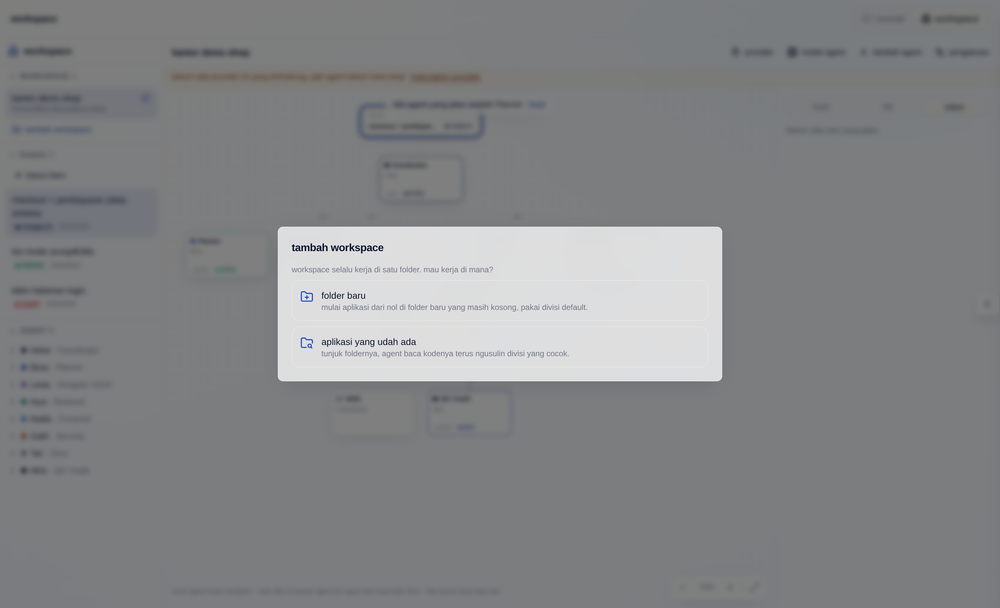
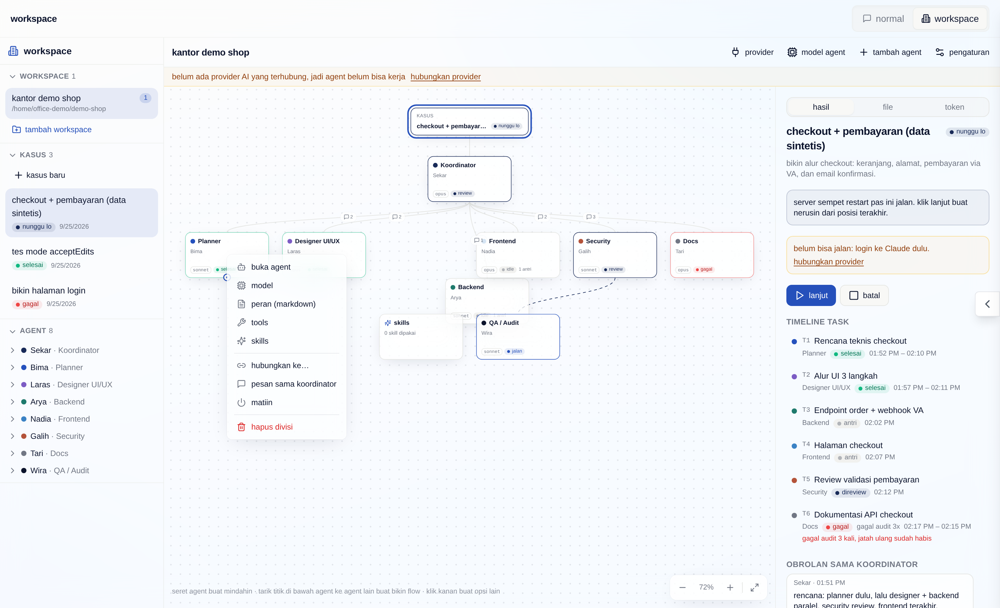
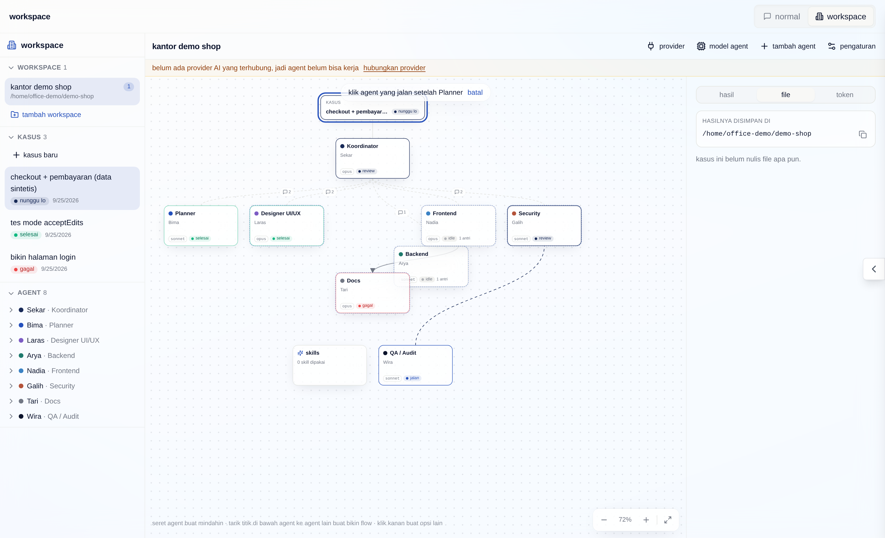
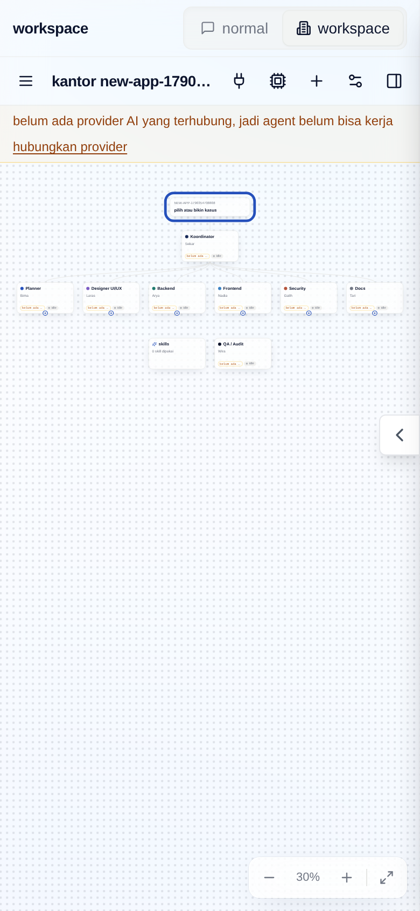
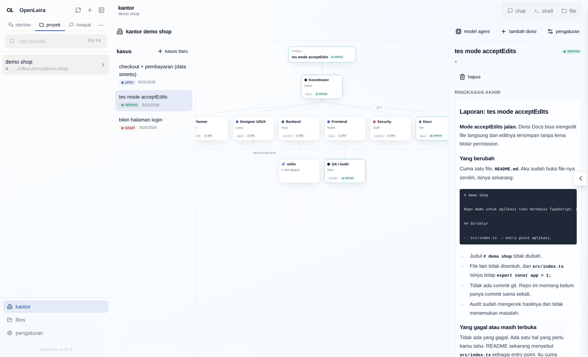

# Workspace (Kantor AI)

Workspace adalah tim agent AI yang bekerja di **satu folder aplikasi**. Tiap divisi diisi satu agent yang fokus ke bidangnya. **Koordinator** menerima kasus dari kamu, memecahnya jadi sub-tugas, membagikannya ke divisi sesuai **flow** yang kamu gambar, meneruskan hasil antar divisi, lalu menulis ringkasan akhir. Dua lapisan lintas-divisi: **Skills** (skill yang dipasang ke agent) dan **Audit** (agent yang memeriksa hasil tiap divisi sebelum dianggap selesai). Satu server bisa punya banyak workspace, satu per aplikasi.



## Konsep

| Istilah | Arti |
| --- | --- |
| Workspace | Satu per folder aplikasi (`offices.project_path`). Bisa banyak per server; dipilih di sidebar mode workspace. Di kode dan API namanya masih `office`. |
| Flow | Panah antar divisi (`office_flow_edges`) yang kamu gambar di kanvas: kerjaan divisi tujuan menunggu kerjaan divisi asal. |
| Divisi | Ruangan di workspace. Default: koordinator, planner, designer UI/UX, backend, frontend, security, docs, dan QA/audit. |
| Agent | Tepat satu per divisi: nama, peran (`role_prompt`), provider + model, tools yang boleh, skills, aktif/tidak. |
| Kasus | Permintaan utama kamu (judul + deskripsi). Status: `draft`, `running`, `waiting_user`, `done`, `failed`. |
| Task | Sub-tugas dari koordinator untuk satu divisi. Status: `queued`, `running`, `review`, `done`, `failed`, `blocked`. |
| Message bus | Semua komunikasi (`assign`, `result`, `question`, `audit_pass`, `audit_fail`, `note`). Divisi tidak pernah bicara langsung satu sama lain. |

Tabel di database: `offices`, `office_divisions` (termasuk posisi node `pos_x`/`pos_y`), `office_agents`, `office_cases`, `office_tasks` (termasuk `changed_files`), `office_messages`, `office_flow_edges`. Kolom yang ditambahkan setelah rilis pertama dibuat lewat migrasi `ALTER TABLE` saat server start. Diberi awalan `office_` karena `case` adalah kata kunci SQL.

## Alur data

```
kamu ──kasus──▶ koordinator (giliran rencana, output JSON)
                   │
                   ▼  task (division_slug, title, instruction, depends_on)
            ┌──────┴──────────────────────────┐
            ▼                                 ▼
   divisi A (sesi provider)         divisi B (menunggu A selesai)
            │ result (## Ringkasan)           ▲
            ▼                                 │ ringkasan A diteruskan lewat message bus
          audit ──pass──▶ done ───────────────┘
            │
            └─fail──▶ queued lagi + catatan audit (maks 2 kali ulang, lalu failed)
                          │
                          └─▶ koordinator diberi tahu (giliran check-in)
semua task selesai ──▶ koordinator menulis ringkasan akhir ──▶ kasus done / failed
```

1. **Rencana.** Koordinator dijalankan sebagai sesi provider biasa (`cwd = project_path`, model = model koordinator) dengan perannya, kasusnya, dan daftar divisi. Dia harus menjawab JSON: `{ summary, tasks: [{ id, division_slug, title, instruction, depends_on }], question }`. Kalau JSON-nya tidak valid, koordinator diminta sekali lagi dengan instruksi yang lebih ketat; kalau tetap gagal, kasus jadi `failed` dengan pesan yang jelas. Kalau kasusnya terlalu kabur, koordinator boleh mengembalikan satu `question` — kasus menunggu jawabanmu.
2. **Eksekusi.** Task jalan hanya kalau semua dependensinya `done`, maksimal `max_parallel` sesi (task + audit) sekaligus per kasus (default 2, bisa diatur di pengaturan workspace). Tiap task = satu sesi provider dengan peran agent divisi + instruksi + ringkasan hasil task dependensinya.
3. **Audit.** Tiap task yang selesai masuk `review`, lalu agent audit menjawab `{ pass, notes, fixes }`. Lolos → `done`. Gagal → `queued` lagi dengan catatan audit ditempel ke instruksi, dan sesi divisi yang sama dilanjutkan dengan umpan balik audit. Setelah 2 kali ulang, task `failed`, task yang bergantung padanya `blocked`, dan koordinator diberi tahu. Jawaban audit yang tidak bisa dibaca dihitung gagal (fail closed).
4. **Check-in koordinator.** Pesanmu ke koordinator dan laporan task yang gagal disimpan sebagai `note` yang belum dibaca. Begitu koordinator bebas, dia dapat giliran check-in: boleh membalas, menambah task, atau mengganti task yang gagal (`replaces`) — task yang tadinya `blocked` lalu menunggu penggantinya.
5. **Ringkasan akhir.** Setelah semua task selesai, koordinator menulis laporan markdown. Kasus `done` kalau semua task selesai (atau task yang gagal sudah digantikan task yang selesai), selain itu `failed`.

Koordinator memakai **satu sesi yang sama** untuk semua gilirannya, jadi dia ingat rencananya sendiri.

### Sesi, permission, dan realtime

- Setiap giliran agent adalah **sesi app biasa**: dibuat lewat `sessionsService.createAppSession` dan dijalankan lewat `runDetachedChatTurn` (runner provider, pemetaan id sesi, notifikasi, dan permission yang sama dengan chat). Sesi muncul di sidebar proyek dan bisa dibuka di chat (tombol **buka di chat**).
- Default mode permission workspace adalah `bypassPermissions`; sebelum kasus pertama jalan muncul peringatan sekali. Mode `acceptEdits` dan `default` bisa dipilih di pengaturan workspace — permintaan izin tool lalu muncul di sesi chat yang bersangkutan.
- Setiap perubahan workspace/divisi/agent/kasus/task/pesan dikirim lewat WebSocket chat yang sudah ada sebagai frame `office:update` berisi baris yang berubah. Transcript sesi yang berjalan mengalir sebagai frame `office:log`. Halaman workspace tidak pernah polling; setelah reconnect dia mengambil snapshot sekali.
- Saat server start, kasus yang tadinya `running` diparkir jadi `waiting_user` (alasan `interrupted`) dan task yang sedang jalan kembali ke `queued`. Klik **lanjut** untuk meneruskan; task melanjutkan sesinya sendiri.

## Mode normal dan mode workspace

Pojok kanan atas header sekarang berisi saklar **normal / workspace** (dulu tempat tab chat, shell, file).

- **Mode normal:** sidebar proyek (obrolan, proyek, riwayat) seperti biasa. Tab chat, shell, file (plus browser/tasks/plugin kalau aktif) pindah ke **rail ikon vertikal** di kiri konten; di HP jadi baris di bawah header.
- **Mode workspace:** sidebar proyek disembunyikan dan diganti sidebar workspace sendiri, jadi dua dunia itu tidak bercampur. Tata letaknya: sidebar workspace di kiri, kanvas di tengah, panel hasil di kanan. Di bawah 900px, sidebar dan panel kanan jadi drawer.



### Sidebar workspace

Tiga grup yang bisa dilipat (diingat per browser):

- **Workspace:** semua workspace dengan path foldernya dan jumlah kasus yang sedang jalan. Klik kanan untuk buka, pengaturan, atau hapus (folder dan isinya tidak ikut terhapus). Tombol **tambah workspace** ada di sini.
- **Kasus:** kasus workspace yang dipilih, plus **kasus baru**.
- **Agent:** tiap agent bisa dibuka (panah) untuk melihat model dan **peran markdown**-nya; klik namanya untuk membuka panel agent.

## Menambah workspace

Workspace selalu terikat ke folder, jadi foldernya dipilih dulu:

1. **Folder baru:** ketik path folder baru (atau cari folder induknya). Folder dibuat dan didaftarkan sebagai proyek lewat alur pembuatan proyek yang sudah ada, lalu workspace dibuat dengan divisi default. Folder yang sudah berisi file ditolak di pilihan ini.
2. **Aplikasi yang udah ada:** tunjuk foldernya. Kalau belum jadi proyek, didaftarkan. Lalu pilih:
   - **Analisis pakai AI.** Pilih model (hanya dari provider yang terhubung). Satu agent membaca repo **read-only** (di Claude hanya `Read`, `Glob`, `Grep`; mode permission `default`) dan menjawab JSON `{ summary, divisions: [...] }`. Kamu review usulannya: ganti nama divisi/agent, edit deskripsi dan peran, hapus, atau tambah. Koordinator dan audit selalu ditambahkan otomatis, dan ringkasan aplikasi ditempel ke peran koordinator. Sesi analisis muncul di riwayat chat proyek. Progresnya dikirim lewat frame WebSocket `office:analysis` (tanpa polling); hasilnya disimpan di memori server selama satu jam.
   - **Pakai divisi default** tanpa analisis.

Path harus berada di dalam `WORKSPACES_ROOT` server, sama seperti pembuatan proyek biasa.



## Setup provider dan model

Wizard setup terbuka sekali per workspace selama setup belum lengkap, dengan dua langkah:

- **Hubungkan provider.** Daftar Claude, Codex, Cursor, dan OpenCode beserta status login-nya. Tombol **hubungkan** membuka terminal di server tempat app jalan (misalnya VPS) dan menjalankan perintah login CLI provider itu, sama seperti di onboarding dan Settings > Agents. Login tersimpan di CLI provider di server; workspace tidak menyimpan API key.
- **Pilih model.** Pilih model per agent atau pakai **terapkan ke semua**. Yang muncul hanya model dari provider yang sudah terhubung. Model yang tersimpan di provider yang kemudian logout tetap terlihat dengan tanda "belum terhubung".

Kasus tidak bisa dijalankan selama ada agent aktif tanpa model atau yang provider-nya belum login; server juga menolak `start`/`resume` dengan kode `OFFICE_PROVIDERS_NOT_CONNECTED`.

## Kanvas

- **Zoom dan geser:** scroll/pinch/tombol + − (keyboard `+` `-` `0`), tarik latar kosong untuk menggeser.
- **Pindah posisi:** tahan dan seret node agent. Posisi disimpan per divisi di server; posisi node skills disimpan di browser. Klik kanan node → **balikin posisi**, atau klik kanan kanvas → **rapiin otomatis**.
- **Gambar flow:** arahkan kursor ke node, tarik titik di bawahnya ke agent lain. Atau klik kanan node → **hubungkan ke…**, lalu klik agent tujuan (cocok untuk layar sentuh). Panah yang akan membuat putaran ditolak.
- **Klik kanan (atau tahan di layar sentuh)** jadi tempat utama aksi, supaya toolbar tidak penuh teks:
  - node: buka agent, model, peran (markdown), tools, skills (masing-masing langsung membuka bagian itu di panel kanan), hubungkan ke…, pesan sama koordinator, aktifin/matiin, balikin posisi, hapus divisi;
  - panah: detail, hapus panah;
  - kanvas kosong: **tambah agent di sini** (agent custom dengan nama, peran, dan warna sendiri, muncul di titik yang diklik), rapiin otomatis, pas layar.
- Tiap node menampilkan model, status live, dan **token** yang dipakai divisi itu di kasus yang dipilih.



### Flow sebagai aturan

Flow adalah aturan, bukan pengganti koordinator. Koordinator tetap merencanakan task, dan prompt-nya menyebutkan flow. Setelah task dibuat, server menambahkan dependensi sesuai flow:

- Task sebuah divisi menunggu **semua task hidup** di divisi yang tepat sebelumnya. Divisi yang tidak dapat kerjaan di kasus itu dilewati (`planner → backend → docs` tetap membuat docs menunggu planner kalau backend tidak dapat task).
- Cabang yang terpisah (misalnya `planner → backend` dan `planner → frontend`) jalan **paralel**.
- Task yang sudah diganti (`replaces`) tidak dihitung; penggantinya yang dihitung.
- Kalau dependensi dari rencana koordinator bertentangan dengan flow sampai membuat task saling tunggu, dependensi rencana itu dibuang: flow yang menang.
- Flow kosong berarti urutan sepenuhnya ditentukan koordinator, seperti sebelumnya. Koordinator dan audit tidak termasuk flow.

Flow diterapkan setiap kali task ditambahkan (rencana awal dan check-in). Mengubah flow di tengah kasus berlaku untuk task yang ditambahkan setelahnya.

## Panel kanan: hasil, file, token

Untuk kasus yang dipilih ada tiga tab:

- **Hasil:** kontrol kasus, timeline task, obrolan dengan koordinator, dan ringkasan akhir (sama seperti sebelumnya).
- **File:** **"hasilnya disimpan di"** path folder workspace (bisa disalin), lalu pohon folder seperti file explorer berisi file yang ditulis/diedit tiap task (dicatat dari tool call `Write`/`Edit`/patch agent; titik warna menunjukkan divisi mana). Klik file untuk pratinjau isinya. File di luar folder workspace ditampilkan terpisah.
- **Token:** total token kasus (input, output, cache), batang per divisi, dan rincian per sesi. Angka diambil dari transcript provider sendiri: sesi Claude dijumlahkan per pesan API, Codex dan OpenCode memakai total berjalan yang mereka laporkan, Cursor tidak melaporkan token. Angka diperbarui saat ada perubahan task/kasus (frame WebSocket), bukan polling.

Klik node atau agent di sidebar membuka panel agent. Setiap bagiannya bisa dilipat: agent (nama, divisi, warna, aktif), model, peran (pratinjau markdown atau edit), tools, skills, serta kerjaan dan transcript.



## API

Semua di bawah `/api/office` (butuh login):

| Method | Path | Fungsi |
| --- | --- | --- |
| GET | `/?projectId=` | Snapshot workspace sebuah folder (atau `null`), termasuk `flow` |
| GET | `/workspaces` | Semua workspace dengan proyek dan jumlah kasus |
| POST | `/` | Bikin workspace `{ projectId, locale, divisions?, appSummary? }` |
| DELETE | `/:officeId` | Hapus workspace (folder tidak disentuh) |
| POST | `/folders` | Siapkan folder `{ path, mode: 'new' \| 'existing' }` |
| POST / GET | `/analyses`, `/analyses/:id` | Mulai / baca analisis aplikasi `{ projectId, provider, model, locale }` |
| POST / DELETE | `/:officeId/flow` | Tambah / hapus panah `{ fromDivisionId, toDivisionId }` |
| GET | `/:officeId/cases/:caseId/usage` | Pemakaian token kasus |
| PATCH | `/:officeId` | `name`, `maxParallel`, `permissionMode`, `permissionWarningAcknowledged` |
| POST/PATCH/DELETE | `/:officeId/divisions[/:divisionId]` | Kelola divisi (termasuk `agentName`, `rolePrompt`, `position`) |
| PATCH | `/:officeId/agents/:agentId` | Edit agent (`model: null` menghapus model) |
| PUT | `/:officeId/agents/models` | Wizard: `{ assignments: [{ agentId, provider, model }] }` |
| POST/GET/PATCH/DELETE | `/:officeId/cases[/:caseId]` | Kelola kasus |
| POST | `/:officeId/cases/:caseId/{start,pause,resume,cancel}` | Kontrol kasus (`start`/`resume` ditolak 409 `OFFICE_PROVIDERS_NOT_CONNECTED` kalau provider agent aktif belum login) |
| POST | `/:officeId/cases/:caseId/notes` | Pesan ke koordinator `{ text }` |

Kode backend ada di `server/modules/office` (orkestrator, parser rencana, scheduler, prompt, runner), repository di `server/modules/database/repositories/office*.db.ts`, frontend di `src/modules/office`.

## Keterbatasan

- **Satu working tree bersama.** Semua divisi bekerja di folder proyek yang sama. Task paralel yang menyentuh file yang sama bisa bentrok; belum ada worktree per divisi. Turunkan `max_parallel` ke 1 kalau itu jadi masalah.
- **Bypass permission ditolak kalau server jalan sebagai root.** Claude Code menolak `--dangerously-skip-permissions` untuk root/sudo, jadi di mode default kasus langsung gagal dengan pesan itu. Jalankan server sebagai user biasa, atau pakai mode `acceptEdits`.
- **Mode permission yang lebih ketat tidak ditampilkan di halaman workspace.** Permintaan izin tool muncul di sesi chat yang bersangkutan; sampai disetujui, task terlihat masih `running`.
- **Jeda tidak menghentikan sesi yang sedang jalan.** Jeda hanya menahan task baru; sesi yang sedang jalan dibiarkan selesai dan hasilnya dicatat. Untuk menghentikan paksa, pakai **batal**.
- **Tidak ada auto-resume setelah restart.** Kasus diparkir sebagai `interrupted` dan perlu diklik **lanjut**.
- **Batas tools hanya untuk Claude.** Untuk Claude, tools di luar daftar dilepas dari toolbox (`disallowedTools`). Codex, Cursor, dan OpenCode hanya dikendalikan mode permission.
- **Skills diambil dari skill Claude** (`~/.claude/skills` dan `.claude/skills` proyek). Agent dengan provider lain hanya diberi tahu nama skill di prompt-nya.
- **Ringkasan hasil diambil dari jawaban agent.** Agent diminta menutup jawabannya dengan bagian `## Ringkasan`; kalau lupa, dipakai ekor jawabannya (maks. 4000 karakter). Tidak ada panggilan LLM terpisah untuk meringkas.
- **Koordinator hanya bisa menambah atau mengganti task,** belum bisa membatalkan task yang sudah direncanakan.
- **Sesi workspace menambah daftar sesi di riwayat proyek.** Tiap task dan audit adalah sesi sendiri (dinamai `<nama workspace> · divisi · T1 judul`), jadi satu kasus bisa menghasilkan belasan sesi.
- **Biaya token.** Tiap task minimal dua giliran (kerja + audit), ditambah giliran koordinator (rencana, check-in, ringkasan).
- **Pembacaan file yang diubah bergantung pada tool call.** File yang diubah lewat `Bash` (misalnya `sed -i` atau generator) tidak tercatat di tab file.
- **Token Cursor tidak tersedia**, dan token sesi yang transcript-nya sudah dihapus dihitung nol.
- **Analisis aplikasi hanya di memori server**; kalau server restart sebelum usulannya dipakai, analisis perlu diulang.
- **Frame `office:log` dan `office:analysis` dikirim ke semua klien yang terhubung.** Cocok untuk pemakaian self-hosted satu user; belum ada langganan per workspace.
- **Sesuai brief, belum ada:** komunikasi langsung antar divisi (semua lewat koordinator), multi-user / hak akses per divisi, dan penjadwalan otomatis.

## Screenshot

| Mode workspace di HP | Kasus nyata yang selesai (UI versi sebelumnya) |
| --- | --- |
|  |  |

Kasus "checkout + pembayaran" di screenshot kanvas memakai data sintetis untuk menunjukkan semua status sekaligus; kasus di screenshot kanan dijalankan sungguhan dengan Claude sebelum tampilan workspace diubah.
