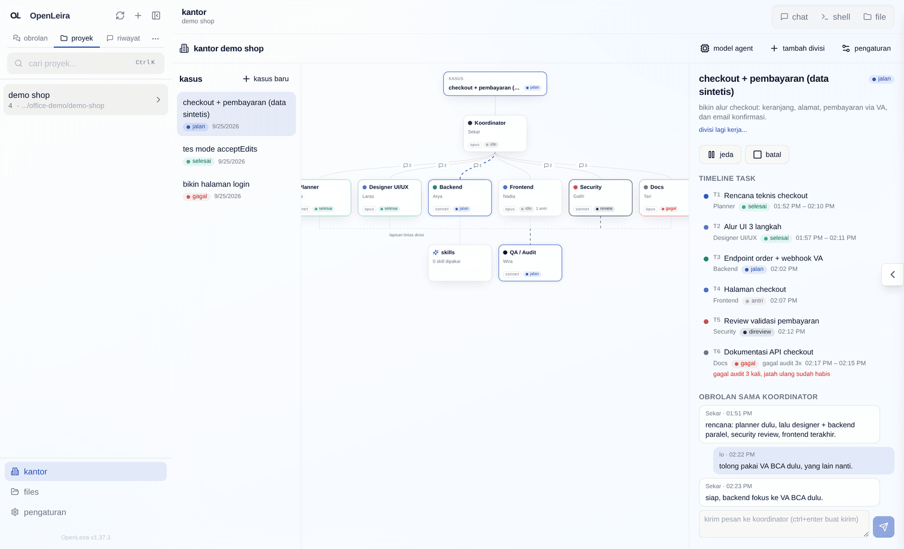
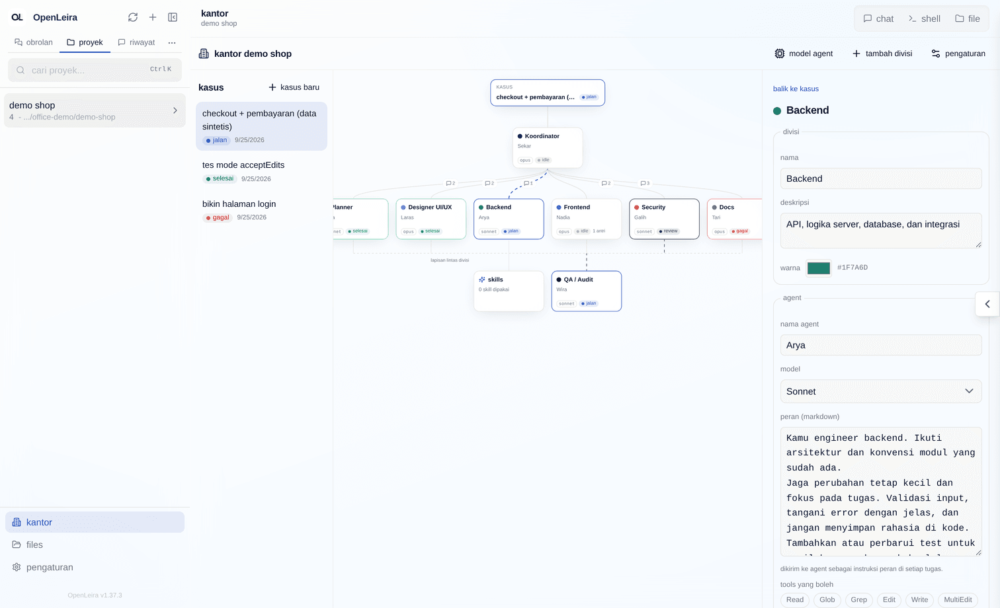
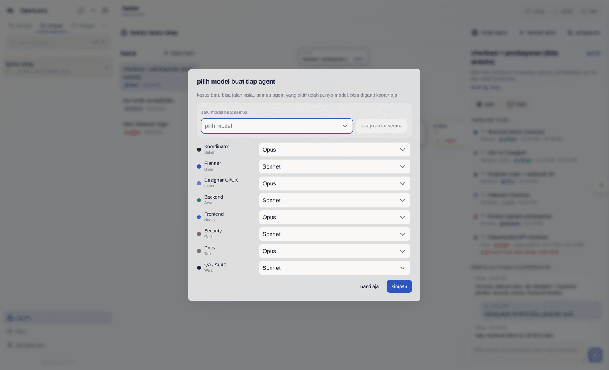
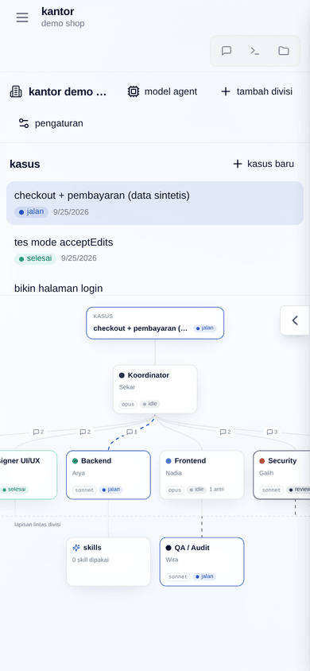
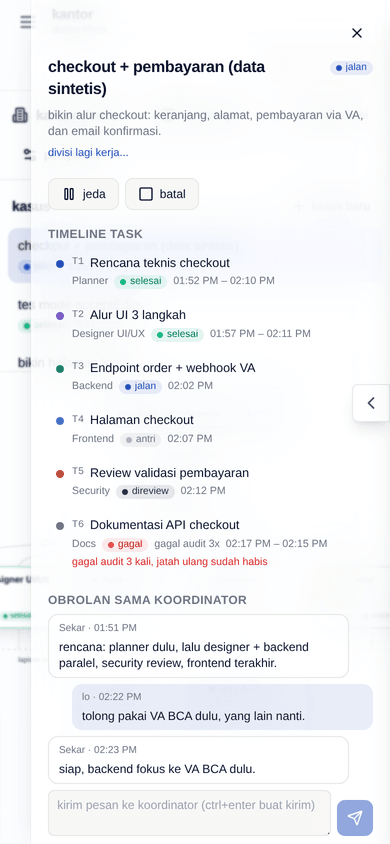

# Kantor AI

Kantor AI memperlakukan satu proyek sebagai kantor. Tiap divisi (ruangan) diisi satu agent AI yang fokus ke bidangnya. **Koordinator** jadi jembatan: dia menerima kasus dari kamu, memecahnya jadi sub-tugas, membagikannya ke divisi, meneruskan hasil antar divisi, lalu menulis ringkasan akhir. Di atas semua divisi ada dua lapisan lintas-divisi: **Skills** (skill yang dipasang ke agent) dan **Audit** (agent yang memeriksa hasil tiap divisi sebelum dianggap selesai).



## Konsep

| Istilah | Arti |
| --- | --- |
| Kantor | Satu per proyek (`offices.project_path`). Dibuat dengan tombol **bikin kantor**. |
| Divisi | Ruangan di kantor. Default: koordinator, planner, designer UI/UX, backend, frontend, security, docs, dan QA/audit. |
| Agent | Tepat satu per divisi: nama, peran (`role_prompt`), provider + model, tools yang boleh, skills, aktif/tidak. |
| Kasus | Permintaan utama kamu (judul + deskripsi). Status: `draft`, `running`, `waiting_user`, `done`, `failed`. |
| Task | Sub-tugas dari koordinator untuk satu divisi. Status: `queued`, `running`, `review`, `done`, `failed`, `blocked`. |
| Message bus | Semua komunikasi (`assign`, `result`, `question`, `audit_pass`, `audit_fail`, `note`). Divisi tidak pernah bicara langsung satu sama lain. |

Tabel di database: `offices`, `office_divisions`, `office_agents`, `office_cases`, `office_tasks`, `office_messages`. Diberi awalan `office_` karena `case` adalah kata kunci SQL.

## Alur data

```
kamu ──kasus──▶ koordinator (giliran rencana, output JSON)
                   │
                   ▼  task (division_slug, title, instruction, depends_on)
            ┌──────┴──────────────────────────┐
            ▼                                 ▼
   divisi A (sesi provider)         divisi B (menunggu A selesai)
            │ result (## Ringkasan)           ▲
            ▼                                 │ ringkasan A diteruskan lewat message bus
          audit ──pass──▶ done ───────────────┘
            │
            └─fail──▶ queued lagi + catatan audit (maks 2 kali ulang, lalu failed)
                          │
                          └─▶ koordinator diberi tahu (giliran check-in)
semua task selesai ──▶ koordinator menulis ringkasan akhir ──▶ kasus done / failed
```

1. **Rencana.** Koordinator dijalankan sebagai sesi provider biasa (`cwd = project_path`, model = model koordinator) dengan perannya, kasusnya, dan daftar divisi. Dia harus menjawab JSON: `{ summary, tasks: [{ id, division_slug, title, instruction, depends_on }], question }`. Kalau JSON-nya tidak valid, koordinator diminta sekali lagi dengan instruksi yang lebih ketat; kalau tetap gagal, kasus jadi `failed` dengan pesan yang jelas. Kalau kasusnya terlalu kabur, koordinator boleh mengembalikan satu `question` — kasus menunggu jawabanmu.
2. **Eksekusi.** Task jalan hanya kalau semua dependensinya `done`, maksimal `max_parallel` sesi (task + audit) sekaligus per kasus (default 2, bisa diatur di pengaturan kantor). Tiap task = satu sesi provider dengan peran agent divisi + instruksi + ringkasan hasil task dependensinya.
3. **Audit.** Tiap task yang selesai masuk `review`, lalu agent audit menjawab `{ pass, notes, fixes }`. Lolos → `done`. Gagal → `queued` lagi dengan catatan audit ditempel ke instruksi, dan sesi divisi yang sama dilanjutkan dengan umpan balik audit. Setelah 2 kali ulang, task `failed`, task yang bergantung padanya `blocked`, dan koordinator diberi tahu. Jawaban audit yang tidak bisa dibaca dihitung gagal (fail closed).
4. **Check-in koordinator.** Pesanmu ke koordinator dan laporan task yang gagal disimpan sebagai `note` yang belum dibaca. Begitu koordinator bebas, dia dapat giliran check-in: boleh membalas, menambah task, atau mengganti task yang gagal (`replaces`) — task yang tadinya `blocked` lalu menunggu penggantinya.
5. **Ringkasan akhir.** Setelah semua task selesai, koordinator menulis laporan markdown. Kasus `done` kalau semua task selesai (atau task yang gagal sudah digantikan task yang selesai), selain itu `failed`.

Koordinator memakai **satu sesi yang sama** untuk semua gilirannya, jadi dia ingat rencananya sendiri.

### Sesi, permission, dan realtime

- Setiap giliran agent adalah **sesi app biasa**: dibuat lewat `sessionsService.createAppSession` dan dijalankan lewat `runDetachedChatTurn` (runner provider, pemetaan id sesi, notifikasi, dan permission yang sama dengan chat). Sesi muncul di sidebar proyek dan bisa dibuka di chat (tombol **buka di chat**).
- Default mode permission kantor adalah `bypassPermissions`; sebelum kasus pertama jalan muncul peringatan sekali. Mode `acceptEdits` dan `default` bisa dipilih di pengaturan kantor — permintaan izin tool lalu muncul di sesi chat yang bersangkutan.
- Setiap perubahan kantor/divisi/agent/kasus/task/pesan dikirim lewat WebSocket chat yang sudah ada sebagai frame `office:update` berisi baris yang berubah. Transcript sesi yang berjalan mengalir sebagai frame `office:log`. Halaman kantor tidak pernah polling; setelah reconnect dia mengambil snapshot sekali.
- Saat server start, kasus yang tadinya `running` diparkir jadi `waiting_user` (alasan `interrupted`) dan task yang sedang jalan kembali ke `queued`. Klik **lanjut** untuk meneruskan; task melanjutkan sesinya sendiri.

## Memakai kantor

1. Pilih proyek di sidebar, lalu klik **kantor** di bagian bawah sidebar.
2. Klik **bikin kantor**. Delapan divisi default dibuat dengan peran bawaan dan **tanpa model**.
3. Wizard **pilih model** terbuka sekali: pilih model per agent (daftar diambil dari katalog model provider di app, termasuk model custom) atau pakai **terapkan ke semua**. Bisa dibuka lagi kapan saja lewat **model agent**. Kasus tidak bisa dijalankan selama ada agent aktif yang belum punya model — alasannya ditampilkan.
4. Buat kasus (judul + deskripsi), lalu **jalanin**. Pantau bagan, timeline task, dan transcript; kirim pesan ke koordinator kapan saja; **jeda**, **lanjut**, atau **batal** (membatalkan menghentikan semua sesi yang sedang jalan).

Bagan bisa di-zoom (scroll, pinch, atau tombol + / − di pojok kanan bawah; keyboard `+` `-` `0`) dan digeser dengan menarik latar kosong atau tombol panah. Tombol pas-layar mengembalikan tampilan awal. Node yang dipilih diberi outline biru.

Klik node divisi untuk mengedit agent dan melihat transcript task-nya; klik garis atau ikon pesan untuk melihat message bus antara koordinator dan divisi itu; klik **skills** untuk melihat skill terpasang dan siapa yang memakainya.



## Menambah divisi

1. Klik **tambah divisi**, isi nama, deskripsi, dan warna. Slug dibuat dari nama (unik per kantor) — itu yang dipakai koordinator di rencana JSON.
2. Klik node divisi baru dan atur agent-nya: nama, peran (markdown), model, tools yang boleh, skills.
3. Deskripsi divisi ikut dikirim ke koordinator saat merencanakan, jadi tulis dengan jelas bidangnya apa.

Divisi bisa dihapus kecuali koordinator dan audit (keduanya hanya bisa diedit), dan tidak bisa dihapus selama masih punya task di kasus yang berjalan. Mematikan agent divisi membuat koordinator tidak menawarkan divisi itu; mematikan audit membuat hasil langsung diterima tanpa pemeriksaan.

## API

Semua di bawah `/api/office` (butuh login):

| Method | Path | Fungsi |
| --- | --- | --- |
| GET | `/?projectId=` | Snapshot kantor proyek (atau `null`) |
| POST | `/` | Bikin kantor `{ projectId, locale }` |
| PATCH | `/:officeId` | `name`, `maxParallel`, `permissionMode`, `permissionWarningAcknowledged` |
| POST/PATCH/DELETE | `/:officeId/divisions[/:divisionId]` | Kelola divisi |
| PATCH | `/:officeId/agents/:agentId` | Edit agent (`model: null` menghapus model) |
| PUT | `/:officeId/agents/models` | Wizard: `{ assignments: [{ agentId, provider, model }] }` |
| POST/GET/PATCH/DELETE | `/:officeId/cases[/:caseId]` | Kelola kasus |
| POST | `/:officeId/cases/:caseId/{start,pause,resume,cancel}` | Kontrol kasus |
| POST | `/:officeId/cases/:caseId/notes` | Pesan ke koordinator `{ text }` |

Kode backend ada di `server/modules/office` (orkestrator, parser rencana, scheduler, prompt, runner), repository di `server/modules/database/repositories/office*.db.ts`, frontend di `src/modules/office`.

## Keterbatasan

- **Satu working tree bersama.** Semua divisi bekerja di folder proyek yang sama. Task paralel yang menyentuh file yang sama bisa bentrok; belum ada worktree per divisi. Turunkan `max_parallel` ke 1 kalau itu jadi masalah.
- **Bypass permission ditolak kalau server jalan sebagai root.** Claude Code menolak `--dangerously-skip-permissions` untuk root/sudo, jadi di mode default kasus langsung gagal dengan pesan itu. Jalankan server sebagai user biasa, atau pakai mode `acceptEdits`.
- **Mode permission yang lebih ketat tidak ditampilkan di halaman kantor.** Permintaan izin tool muncul di sesi chat yang bersangkutan; sampai disetujui, task terlihat masih `running`.
- **Jeda tidak menghentikan sesi yang sedang jalan.** Jeda hanya menahan task baru; sesi yang sedang jalan dibiarkan selesai dan hasilnya dicatat. Untuk menghentikan paksa, pakai **batal**.
- **Tidak ada auto-resume setelah restart.** Kasus diparkir sebagai `interrupted` dan perlu diklik **lanjut**.
- **Batas tools hanya untuk Claude.** Untuk Claude, tools di luar daftar dilepas dari toolbox (`disallowedTools`). Codex, Cursor, dan OpenCode hanya dikendalikan mode permission.
- **Skills diambil dari skill Claude** (`~/.claude/skills` dan `.claude/skills` proyek). Agent dengan provider lain hanya diberi tahu nama skill di prompt-nya.
- **Ringkasan hasil diambil dari jawaban agent.** Agent diminta menutup jawabannya dengan bagian `## Ringkasan`; kalau lupa, dipakai ekor jawabannya (maks. 4000 karakter). Tidak ada panggilan LLM terpisah untuk meringkas.
- **Koordinator hanya bisa menambah atau mengganti task,** belum bisa membatalkan task yang sudah direncanakan.
- **Sesi kantor menambah daftar sesi di sidebar.** Tiap task dan audit adalah sesi sendiri (dinamai `kantor … · divisi · T1 judul`), jadi satu kasus bisa menghasilkan belasan sesi.
- **Biaya token.** Tiap task minimal dua giliran (kerja + audit), ditambah giliran koordinator (rencana, check-in, ringkasan).
- **Frame `office:log` dikirim ke semua klien yang terhubung.** Cocok untuk pemakaian self-hosted satu user; belum ada langganan per kantor.
- **Sesuai brief, belum ada:** komunikasi langsung antar divisi (semua lewat koordinator), multi-user / hak akses per divisi, dan penjadwalan otomatis.

## Screenshot

| Kasus nyata yang selesai | Wizard model |
| --- | --- |
|  |  |

| Mobile: bagan bisa di-scroll | Mobile: panel jadi drawer |
| --- | --- |
|  |  |

Kasus "checkout + pembayaran" di screenshot pertama dan panel agent memakai data sintetis untuk menunjukkan semua status sekaligus; kasus "tes mode acceptEdits" dijalankan sungguhan dengan Claude.
